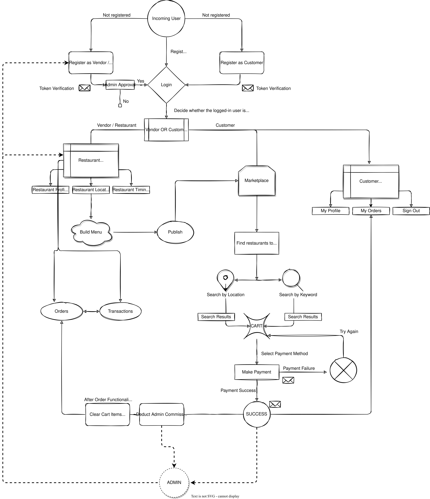
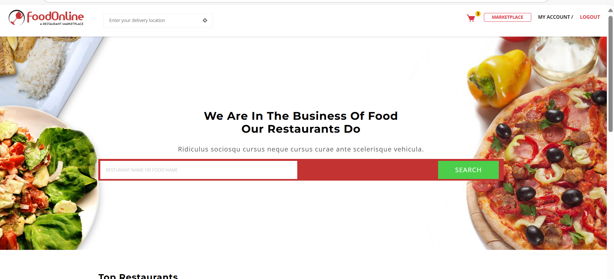
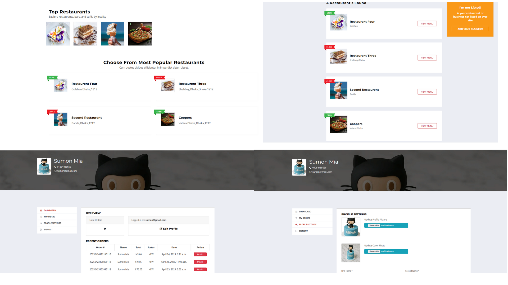
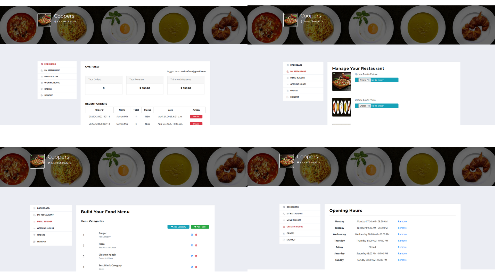
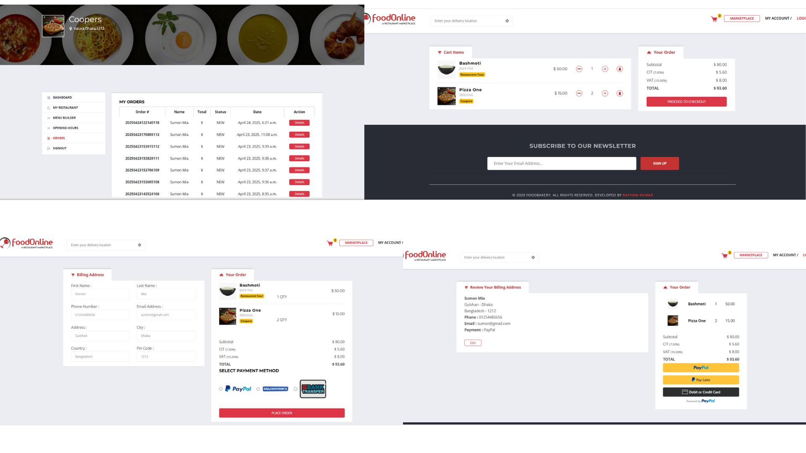

# 🍔 FoodOnline - Multi-Vendor Restaurant Marketplace

FoodOnline is a modern, feature-packed multi-vendor food ordering platform where restaurants can manage menus, customers can place orders, and admins can monitor everything—all built using **Django**, **jQuery**, and **PayPal** for payments.

## 🔥 Features

- ✅ Multi-vendor architecture (individual dashboards for each restaurant)
- 🍽 Restaurant listing, filtering, and details view
- 🧳 Menu management by each restaurant
- 🛒 Shopping cart & order placement
- 💸 PayPal payment integration
- ⏲️ Restaurant opening hours
- 🔐 Customer authentication & profile management
- 📊 Admin & Vendor dashboards
- 📥 Email order confirmation (optional)
- 🌐 Dual DB Support: SQLite (dev) & PostgreSQL (prod)

---

## 💻 Tech Stack

| Layer         | Tech                            |
|--------------|----------------------------------|
| Backend       | Python, Django     |
| Frontend      | HTML, CSS, Bootstrap, jQuery    |
| Payment       | PayPal REST API                 |
| Database      | SQLite (dev) / PostgreSQL (prod)|
| Auth          | Django Custom built-in Auth            |
| Deployment    | localhost  |

---

## 📸 Screenshots

Screenshots are included to demonstrate:
- FlowChart

- Customer UI


- Vendor dashboard

- Order processing

- Database 

## ⚖️ Setup & Installation

### 1. Clone Repo
```bash
git clone https://github.com/CoderMahruf/multivendor.git
```

### 2. Create Virtual Environment
```bash
python -m venv env
source env/bin/activate  # on Windows: env\Scripts\activate
```

### 3. Install Dependencies
```bash
pip install -r requirements.txt
```


## ✨ Credits

- UI inspired by **FoodBakery Theme**
- Developed by [Mahruful Alam]
- Thanks to Django & PayPal APIs

---

